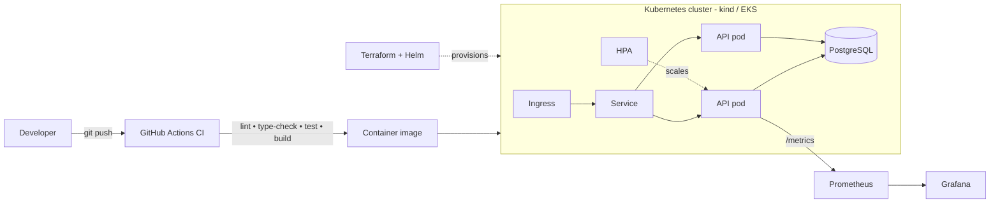

# Cloud-Native URL Shortener — DevOps / Platform Flagship

A small but production-shaped URL shortener, built to demonstrate an end-to-end DevOps / platform-engineering workflow: a tested Python service, containerized, deployed to Kubernetes via Helm, provisioned with Terraform, and observed with Prometheus + Grafana.

> **Why this project exists:** it closes the gaps most Berlin DevOps postings ask for — Kubernetes, Terraform/IaC, Helm, and a real web framework — while re-proving Docker, CI/CD, and Grafana. It runs entirely on a laptop (`kind` + Terraform), so it costs nothing to build.

---

## Architecture



## What this demonstrates

| Capability | Where |
|---|---|
| Python web service (FastAPI) | `app/` |
| SQLAlchemy + PostgreSQL, Pydantic validation | `app/models.py`, `app/schemas.py` |
| Tested code behind a coverage gate | `tests/`, `pyproject.toml` (`--cov-fail-under`) |
| Multi-stage Docker, non-root, healthcheck | `Dockerfile` |
| CI/CD: lint, type-check, test, image build | `.github/workflows/ci.yml` |
| Kubernetes: Deployment, Service, Ingress, ConfigMap, Secret, HPA, probes | `k8s/` |
| Helm packaging | `helm/urlshortener/` |
| Infrastructure as Code | `terraform/` |
| Observability (Prometheus metrics + Grafana) | `monitoring/`, `/metrics` endpoint |
| SRE objectives, alerts, and security guidance | `docs/sre-and-security.md`, `monitoring/sre-alerts.yaml`, `k8s/rbac.yaml` |

## Tech stack

Python 3.12 · FastAPI · SQLAlchemy · PostgreSQL · pytest · ruff · mypy · Docker · GitHub Actions · Kubernetes · Helm · Terraform · Prometheus · Grafana

---

## Build order (how to grow this repo)

Each layer is a self-contained checkpoint — you have something demonstrable at every step, and you can stop after Layer 4 and still have closed the biggest gap (Kubernetes).

**Layer 1–3 · App + Docker + CI** *(already scaffolded)*
```bash
make install          # install app + dev deps
make test             # pytest with coverage gate
make run              # run locally on http://localhost:8000  (docs at /docs)
make docker-build     # multi-stage image
```

**Layer 4 · Kubernetes (local, free)** — the highest-value gap to close
```bash
make kind-up          # create a local cluster
make docker-build
make image-load       # load your image into kind
kubectl apply -f k8s/
kubectl get pods -n urlshortener
```

**Layer 5 · Helm**
```bash
make helm-install
helm template ./helm/urlshortener   # inspect rendered manifests
```

**Layer 6 · Terraform (via the Helm provider)**
```bash
make tf-init
make tf-apply
```

**Layer 7 · Observability**
```bash
make compose-up       # app + Postgres + Prometheus (:9090) + Grafana (:3000)
# In Grafana (admin/admin) add Prometheus (http://prometheus:9090) and import monitoring/grafana-dashboard.json
```

**Optional · AWS (do this last, briefly)**
Swap the local cluster for AWS EKS to add the "AWS" keyword. EKS is *not* free, so: provision → capture a screenshot + a working commit → `terraform destroy` immediately. Do **not** list AWS on your CV until you've actually run this.

---

## Local quickstart

```bash
python -m venv .venv && source .venv/bin/activate
pip install -e ".[dev]"
uvicorn app.main:app --reload
```
Then:
```bash
curl -X POST localhost:8000/shorten -H 'content-type: application/json' -d '{"target_url":"https://anthropic.com"}'
# -> {"short_code":"ab12Cd", ...}
curl -i localhost:8000/ab12Cd        # 307 redirect
curl localhost:8000/stats/ab12Cd     # click count
```

## Continuous integration

On every push and pull request to `main`, GitHub Actions runs: `ruff check`, `ruff format --check`, `mypy`, and `pytest` behind an 85% coverage gate, then builds the Docker image. See `.github/workflows/ci.yml`.

## Reliability and security

See [SRE and security practices](docs/sre-and-security.md) for the availability and latency SLOs, error-budget policy, incident workflow, capacity planning, RBAC, secret-handling, OIDC, and policy-enforcement approach. Prometheus alert rules are in [sre-alerts.yaml](monitoring/sre-alerts.yaml).

---

## Résumé bullets (claim each only once the layer actually works)

- Built and deployed a containerized Python (FastAPI) service to Kubernetes, packaged with Helm and provisioned via Terraform, with Prometheus/Grafana observability.
- Implemented a GitHub Actions CI pipeline enforcing linting, type-checking, and a test-coverage gate before building and publishing the image.
- Configured Kubernetes Deployment, Service, Ingress, and Horizontal Pod Autoscaler with health/readiness probes and resource limits.

## To personalise

- Replace this project name / description with your own framing.
- Add 1–2 screenshots (Grafana dashboard, `kubectl get pods`) to a `docs/` folder — reviewers skim, visuals help.
- Point `DATABASE_URL` at a managed Postgres for any cloud deployment.
